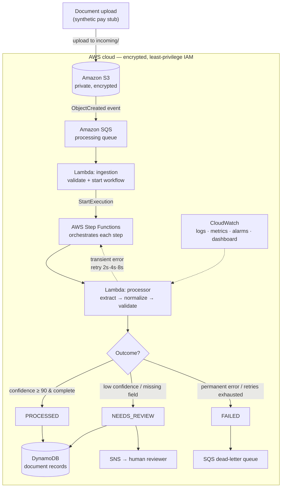

# MortgageFlow Guardian

**AI-powered reliability and incident automation for mortgage document workflows.**

> ⚠️ **Fictional proof of concept.** This project uses **synthetic data only** —
> no real mortgage, financial, or personal information. It is inspired by the
> general engineering challenges of enterprise document workflows. It does **not**
> claim that any specific company lacks these capabilities, does not approve or
> deny mortgages, and does not replace a loan-origination system. It demonstrates
> the reliability, security, and observability layer *around* an AI document
> pipeline.

---

## ✅ Status


- ☁️ **Deployed and running in AWS** — 31 resources provisioned via Infrastructure as Code (S3, SQS, Lambda, Step Functions, DynamoDB, SNS, CloudWatch, IAM).
- 🤖 **Real Claude LLM extraction** — a genuine Anthropic Claude provider runs behind the same interface as the mock ([`src/extraction/claude_provider.py`](src/extraction/claude_provider.py)).
- 📊 **Live interactive dashboard** — an animated pipeline with a **Mock ↔ real-Claude** toggle ([`dashboard.py`](dashboard.py), also deployed on Streamlit Community Cloud).
- 🏗️ **Infrastructure as Code** — validated with both **Terraform** and **OpenTofu**.
- 🐳 **Containerized** — a [`Dockerfile`](Dockerfile) for the dashboard (portable to ECS / Kubernetes, with a healthcheck).
- 🔄 **CI/CD** — GitHub Actions runs lint (ruff), tests (pytest), a security scan (bandit), and Terraform validation on every push.

### Run it four ways
| Surface | Command |
|---|---|
| Local demo (no AWS, no cost) | `python demo.py` |
| Interactive dashboard | `streamlit run dashboard.py` |
| Real Claude LLM | `export ANTHROPIC_API_KEY=sk-ant-... && python llm_demo.py` |
| In a container | `docker build -t mortgageflow-dashboard . && docker run -p 8501:8501 mortgageflow-dashboard` |

---

## 1. Project overview

MortgageFlow Guardian receives a fictional pay stub, sends it to an AI extraction
service, and then does the hard engineering part: it **standardizes, validates,
monitors, and safely integrates** that AI output before any downstream system is
allowed to trust it.

It is built as an **event-driven, serverless AWS system** with Infrastructure as
Code, automated tests, CI, and end-to-end observability. The AI extractor sits
behind a swappable interface: a **mock** provider (deterministic, free) for
testing every path, and a **real Anthropic Claude** provider for genuine LLM
extraction — interchangeable with a one-line change. It runs **fully on a laptop**
(no AWS required), **live on AWS** (deployed), and **inside a Docker container**.

## 2. Business problem

When AI extracts data from documents, the raw output is inconsistent and
sometimes wrong: fields are named differently across providers, values are
formatted differently (`"$3,250.00"` vs `3250`), confidence varies, some results
are incomplete, and providers occasionally time out or fail. If a downstream loan
system consumed that raw output directly, it would have to understand every
provider quirk and would risk acting on low-confidence or incomplete data.

**The engineering challenge:** make AI document output *trustworthy* —
standardized, validated, resilient to failure, auditable, and secure — at scale.

## 3. Solution

A reusable **orchestration and reliability layer** that sits between document
uploads, AI services, and downstream systems. It:

1. Validates that extracted data is complete and correctly typed.
2. Stores valid results in a standard schema.
3. Routes low-confidence or incomplete results to **human review**.
4. **Retries** temporary failures automatically with exponential backoff.
5. Sends permanent failures to a **dead-letter queue** (never dropped).
6. Detects **duplicate** documents via a content hash.
7. Records logs, metrics, retry counts, and processing status.
8. **Alerts** a human when intervention is required.

## 4. Architecture



A detailed written walkthrough — including trust boundaries and each path — is in
[`architecture/architecture.md`](architecture/architecture.md).

## 5. AWS services and why each was selected

| Service | Role | Why this service |
|---|---|---|
| **Amazon S3** | Stores uploaded documents | Durable, cheap, encrypts at rest, and emits events to start the pipeline |
| **Amazon SQS** | Buffers processing work | Decouples ingestion from processing; absorbs spikes; preserves work on failure |
| **SQS dead-letter queue** | Preserves failed messages | Nothing is silently lost; failures can be inspected and replayed |
| **AWS Step Functions** | Orchestrates the workflow | Declarative retry/catch, each step visible in the console — far clearer than one giant Lambda |
| **AWS Lambda** | Runs the code | Serverless, event-driven, scales to zero — you pay only when documents flow |
| **Amazon DynamoDB** | Stores document records | Simple key lookups, no joins, single-digit-ms reads, no idle cost |
| **Amazon SNS** | Human-review alerts | Fan-out to email/Slack without coupling the workflow to a delivery mechanism |
| **Amazon CloudWatch** | Observability | Logs, custom metrics, alarms, and a dashboard for proactive incident response |
| **AWS IAM** | Access control | Least-privilege roles so each component can do only its own job |

## 6. End-to-end workflow

1. A fictional document is uploaded to S3 under `incoming/`.
2. S3 emits an event to the SQS processing queue.
3. The **ingestion Lambda** validates file type/size and starts a Step Functions
   execution.
4. Step Functions invokes the **processor Lambda**, which extracts (mock AI),
   normalizes to one schema, validates fields + confidence, and stores the
   record in DynamoDB.
5. Step Functions routes on the result:
   - **PROCESSED** → done.
   - **NEEDS_REVIEW** → publish an SNS alert to a human.
   - **Transient error** → Step Functions retries with backoff.
   - **Permanent error / exhausted retries** → the message is sent to the
     dead-letter queue and the execution ends as failed.
6. CloudWatch records logs, metrics, and raises alarms throughout.

## 7. Security design

- **S3**: public access fully blocked, encryption at rest (AES-256), HTTPS-only
  bucket policy (encryption in transit), versioning for recovery.
- **IAM**: least-privilege roles — no `AdministratorAccess`. The ingestion
  function cannot touch the database; the processor can read one prefix and write
  one table; Step Functions can invoke only the processor and publish to one topic.
- **No credentials in source code**: everything uses IAM roles; a Secrets Manager
  placeholder is documented for future external AI credentials.
- **Sanitized logs**: sensitive fields (names, pay, pay period) are masked before
  anything is logged, so personal data never lands in CloudWatch.
- **Input validation**: file type and size are checked before processing.
- **Separate paths**: `incoming/` vs failed handling keeps clean and problem
  documents apart.
- **Synthetic data only.**

## 8. Failure-handling strategy

Failures are classified into explicit categories (see `src/shared/models.py`),
and each maps to one action:

| Category | Action |
|---|---|
| `TEMPORARY_PROVIDER_ERROR` | Retry with exponential backoff (2s, 4s, 8s) |
| `PERMANENT_PROVIDER_ERROR`, `INVALID_DOCUMENT`, `DATABASE_ERROR`, `UNKNOWN_ERROR` | Dead-letter (preserve, stop) |
| `LOW_CONFIDENCE`, `MISSING_REQUIRED_FIELD`, `INVALID_AI_OUTPUT` | Human review |
| `DUPLICATE_DOCUMENT` | Skip (already processed) |

Retries live in **two layers**: the application understands retryability, and
**Step Functions performs the retries declaratively** so they are visible in the
execution history.

## 9. Human-in-the-loop design

AI performs extraction and organization, but a human retains authority whenever a
result is incomplete, uncertain, or business-sensitive. Confidence thresholds
(demonstration values) drive the routing:

- **≥ 90** → trusted, `PROCESSED`.
- **< 90** or any missing required field → `NEEDS_REVIEW` (an SNS alert is raised).

Uncertain data is **never silently auto-accepted**.

## 10. Database design

DynamoDB table keyed by `documentId`, with two global secondary indexes:

- `documentHash-index` — powers duplicate detection (find a document by its
  SHA-256 content hash).
- `processingStatus-index` — powers "list everything awaiting review".

Access patterns are simple key lookups with no joins, which is exactly why a
key-value store is the right fit over a relational database for this workload.

## 11. CI/CD process

GitHub Actions (`.github/workflows/ci.yml`) runs on every push/PR:

1. Install Python dependencies
2. Lint (fail only on real errors)
3. Syntax check
4. **pytest** (blocking)
5. Security scan with bandit (non-blocking)
6. `terraform fmt -check` (blocking)
7. `terraform init -backend=false` + `terraform validate` (blocking)

The pipeline **fails and stops** if tests or Terraform validation fail. It does
**not** deploy to AWS — deployment is a deliberate manual step.

## 12. Testing strategy

21 unit tests (`tests/`) cover the four required scenarios plus duplicate
detection, using the mock provider and a no-op sleep so retries don't slow the
suite:

- normalizer (field-name and format variations)
- validator (complete / missing field / low confidence)
- classifier (category → action mapping)
- pipeline end-to-end (success, retry-then-recover, needs-review, permanent
  failure, duplicate)

## 13. Local setup instructions

```bash
cd /Users/brundachagari/new-project/pennymac-final-project
python3 -m venv .venv
source .venv/bin/activate
pip install -r requirements.txt
pytest -q          # 21 tests
```

## 14. AWS deployment instructions

> Deploying creates real (mostly free-tier) resources. Do this only when ready.

```bash
# 1. Package the Lambda functions
./scripts/build_lambdas.sh

# 2. Provision the infrastructure
cd infrastructure
terraform init
terraform plan   -var="reviewer_email=you@example.com"
terraform apply  -var="reviewer_email=you@example.com"

# 3. Confirm the SNS email subscription (click the link AWS emails you)

# 4. Tear everything down when finished
terraform destroy -var="reviewer_email=you@example.com"
```

## 15. Demo instructions

**Local (recommended for interviews — no AWS, no cost):**

```bash
python demo.py
```

Shows all five paths: success, human-review, retry-then-recover, permanent
failure (dead-letter), and duplicate detection.

**On AWS:** upload a sample file to `s3://<bucket>/incoming/`. The mock scenario
is chosen from the file name, so you can trigger any path:

| File name contains | Path exercised |
|---|---|
| (default) | PROCESSED |
| `lowconf` | NEEDS_REVIEW (low confidence) |
| `missing` | NEEDS_REVIEW (missing field) |
| `timeout` | retries → dead-letter |
| `corrupt` | permanent failure → dead-letter |

## 16. Estimated AWS cost considerations

Designed to sit inside the **AWS Free Tier** for a demo. All services are
pay-per-use and scale to zero:

- Lambda, Step Functions, SQS, SNS: effectively free at demo volumes.
- DynamoDB on-demand: pennies for thousands of items.
- S3: negligible for a few small files.
- CloudWatch: main cost is log retention — capped here at 14 days.

Running the demo a few times costs roughly **$0**. `terraform destroy` removes
everything so there is no lingering cost.

## 17. Architectural trade-offs

- **SQS before processing** vs S3 invoking Lambda directly → chose SQS for
  buffering, retries, and spike protection.
- **Step Functions** vs one large Lambda → chose Step Functions for visibility,
  declarative retry/catch, and independent step troubleshooting.
- **DynamoDB** vs relational → chose key-value because access patterns are simple
  lookups with no joins.
- **Retry in orchestration** vs in code → chose Step Functions retries so they
  are observable in execution history.
- **Provider interface** vs hard-coding one AI vendor → chose an abstraction to
  avoid lock-in and allow Bedrock/Textract/Vertex later.

## 18. Current limitations

- The demo defaults to a **mock** extractor (free, deterministic, offline). A
  **real Claude LLM extractor** (`src/extraction/claude_provider.py`) is
  included and plugs into the same interface — run `python llm_demo.py` with an
  `ANTHROPIC_API_KEY` set. Bedrock/Textract/Vertex adapters remain future work
  behind the same abstraction.
- One document type (pay stub) is supported.
- Human review is modeled via alerts + status; there is no reviewer UI yet.
- No authentication layer in front of the (future) results API.

## 19. Future improvements

- Real AI provider adapters (Bedrock, Textract, Vertex AI).
- A results API (API Gateway) and a reviewer dashboard.
- Secrets Manager for external AI credentials.
- Data retention/deletion lifecycle policies on S3 and DynamoDB TTL.
- KMS customer-managed keys instead of AWS-managed encryption.
- Multi-document-type support and a model-comparison harness.

## 20. Interview talking points

- **"I built the reliability layer around AI, not another AI demo."** The value
  is standardization, validation, resilience, and observability.
- **Layered reliability**: application-aware retryability + declarative Step
  Functions retries + dead-letter preservation + idempotency via content hash.
- **Security by default**: blocked public access, encryption in transit and at
  rest, least-privilege IAM, sanitized logs.
- **Provider abstraction**: swapping the mock for Bedrock/Vertex requires one new
  class and zero pipeline changes.
- **Truthful failure accounting**: permanent failures don't waste retries; the
  attempt count reflects reality (a bug I caught and fixed).
- **Right tool for the job**: DynamoDB for key lookups, SQS for buffering, Step
  Functions for orchestration — each choice defensible with its trade-off.
