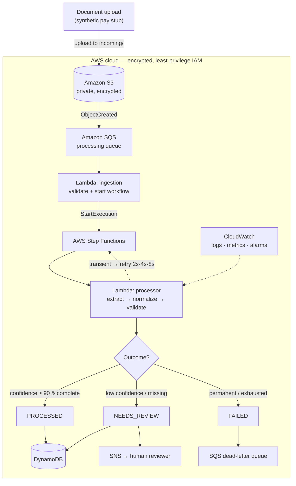

# Architecture — MortgageFlow Guardian

> Fictional proof of concept. Synthetic data only.

A rendered image version is in [`architecture.svg`](architecture.svg). This
document explains the same system in words: the diagram, each connection, the
trust boundaries, and the four paths a document can take.

## Diagram

## Each connection, explained

| Connection | What happens | Why |
|---|---|---|
| Upload → S3 | A synthetic file is written under `incoming/` | S3 is durable, encrypted storage and the event source |
| S3 → SQS | S3 emits an `ObjectCreated` event to the queue | Decouples "a file arrived" from "process it" |
| SQS → ingestion Lambda | The queue triggers the function | Buffering + automatic retry + dead-letter on poison messages |
| ingestion → Step Functions | `StartExecution` with `{bucket, key}` | Hands a validated job to the orchestrator |
| Step Functions → processor | Invokes the task Lambda | The workflow controls each step, retry, and routing |
| processor ↺ Step Functions | Transient errors bubble up; SF retries with backoff | Retries are declarative and visible in execution history |
| processor → DynamoDB | Stores the standardized record | Fast key-value persistence with hash + status indexes |
| Step Functions → SNS | Publishes a review alert when needed | Notifies a human without coupling to email/Slack |
| Step Functions → SQS DLQ | Sends permanently-failed jobs to the DLQ | Nothing is dropped; failures are inspectable |
| CloudWatch ↔ everything | Collects logs, metrics, alarms | Proactive incident detection |

## Trust boundaries

- **Outside the boundary:** the uploader/client. It can only *put* a file into
  the `incoming/` prefix of the bucket. It has no direct access to the queue,
  functions, database, or workflow.
- **Inside the AWS boundary:** all processing. Every component runs with a
  least-privilege IAM role, data is encrypted in transit (HTTPS-only) and at rest
  (S3 AES-256, SQS/DynamoDB encryption), and no component can reach beyond its own
  job.
- **Data-sensitivity boundary:** extracted personal data lives only in DynamoDB.
  It is **never** written to logs (logs are sanitized) and **never** included in
  SNS messages (alerts carry only the document id and reasons).

## The four paths

### 1. Success path
`upload → S3 → SQS → ingestion → Step Functions → processor → PROCESSED → DynamoDB`
The document is complete and confidence ≥ 90. It is stored and the execution
succeeds. No human involved.

### 2. Retry path
`processor raises TemporaryProviderError → Step Functions waits (2s, 4s, 8s) → retries`
A transient failure (e.g. a provider timeout) is retried with exponential
backoff. If a later attempt succeeds, the document continues down the success or
human-review path. The attempt count is recorded.

### 3. Human-review path
`processor → NEEDS_REVIEW → DynamoDB + SNS → human reviewer`
The data is incomplete or confidence is below 90. The record is stored with the
status `NEEDS_REVIEW` and the specific reasons, and an SNS alert is published.
The data is never auto-trusted.

### 4. Permanent-failure path
`processor raises a permanent error (or retries are exhausted) → Step Functions Catch → SQS dead-letter queue → execution Fails`
Corrupt files, unsupported formats, or repeatedly-failing providers end here. The
message is preserved in the dead-letter queue for inspection or replay — it is
never silently lost — and a CloudWatch alarm fires.
